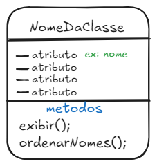

# Progamação Orientada a Objetos




## MVC - Model View Control:
- Pasta Modelo (classes);
- Pasta Visão (visão do usuário);
- Pasta Controle (tratamento de dados da visão e envio para o Modelo).


### Primeira classe de Hello World!
```java
package AULA_1; //equivale a pasta onde está o .java
//Visão Pública - Definição de Classe - Nome da Classe
public class HelloWorld {
    //Visão Pública - Não será alterado durante a exec - Não retorna valor - Nome do Método - Argumentos
    public static void main (String[] args) {

        System.out.println("Hello World!");
    }
}
```

> __Nome de Classe começa com maiúsculo.__ 

!comentar cod!
```Java
package AULA_1;
/*importando a pasta de utilitarios de java, nesse casa é importado somente o objeto Scanner de until*/
import java.until.Scanner;

public class HelloWorld {
    public static void main (String[] args) {
        int valor = 10;
        System.out.println("Valor: " + valor);
        /*iniciando a variavel leia como tipo obejto Scanner e inicializando ela com o */
        Scanner leia = new Scanner(System.in);
        System.out.println("Digite um valor:");
        int valor1 = leia.nextInt();//nextDouble-nextFloat-next(pega em carac)
        System.out.println("Digite outro valor:");
        int valor2 = leia.nextInt();
        int total = valor1 + valor2;
        System.out.println("Soma:" + total);
        leia.close();
    }
}
```
## Variaveis

|   Type  |      Set of values      |            Values            | Operators |
|:-------:|:-----------------------:|:----------------------------:|:---------:|
|  short  |         integers        | between -2^15 and + (2^15)-1 | + - * / % |
|   int   |         integers        | between -2^31 and + (2^31)-1 | + - * / % |
|  long   |         integers        | between -2^63 and + (2^63)-1 | + - * / % |
|  float  |         integers        |     real numbers 32 bit      |  + - * /  |
|  double |  floating-point numbers |     real numbers 64 bit      |  + - * /  |
| boolean |      boolean values     |         true or false        | && \|\| ! |
|   char  |        characters       |         16 bit               |           |
|  String | sequences of characters |it's not a primitive data type|           |

```java
```
